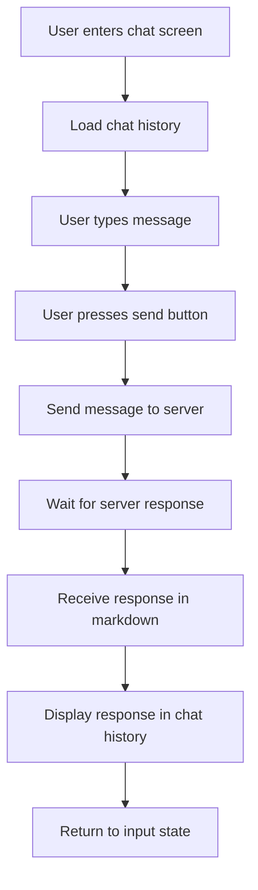
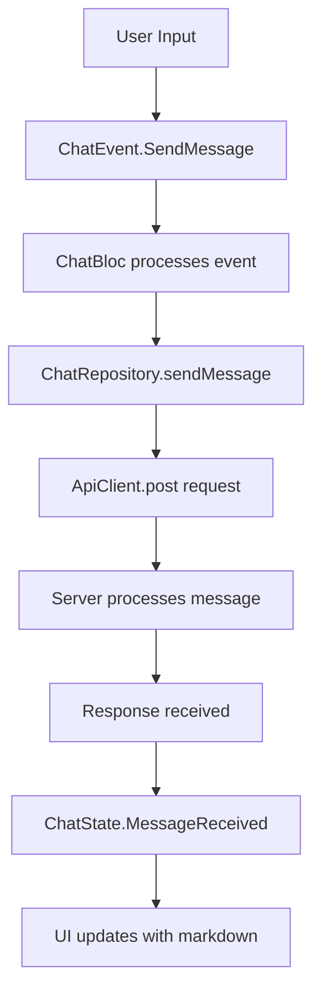

# Chat Screen

**Path:** `lib/src/presentation/chat/chat_screen.dart`  
**Purpose:** Allow users to chat with a chatbot by sending messages and receiving responses in markdown format.  
**Design:** Modern chat interface with message history and real-time communication  
**Last Updated:** July 11th, 2025

---

## Quick Overview

**Key Features:**
- **Chat History:** Display conversation history with user and bot messages
- **Message Input:** Text field for users to type and send messages
- **Markdown Support:** Bot responses are rendered in markdown format
- **Real-time Communication:** Send messages to server and wait for responses
- **State Management:** BLoC pattern for managing chat state and events
- **UI Package:** Uses `flutter_chat_ui` package for modern chat interface

---

## Key Files

```
lib/
└── src/
    ├── presentation/
    │   └── chat/
    │       ├── chat_screen.dart                    # Main chat UI widget
    │       └── bloc/
    │           ├── chat_bloc.dart                  # Chat business logic
    │           ├── chat_event.dart                 # Chat events
    │           └── chat_state.dart                 # Chat state management
    ├── domain/
    │   └── repository/
    │       └── chat_repository.dart                # Chat repository interface
    └── data/
        ├── repository/
        │   └── chat_repository_impl.dart           # Chat repository implementation
        └── datasource/
            └── api_client.dart                     # API client for chat endpoints
```

---

## Workflow

### 1. Chat Flow



### 2. Message Flow



---

## Screen Requirements

**UI Components:**
- AppBar with title
- Chat history list (scrollable) using `flutter_chat_ui`
- Message input field with send button using `flutter_chat_ui`
- Support for text and markdown messages

**Functionality:**
- Display conversation history using `flutter_chat_ui` components
- Send messages to chatbot
- Receive and display bot responses in markdown format
- Loading states during message sending
- Error handling for failed requests
- Modern chat UI with bubbles, timestamps, and proper styling

**Dependencies:**
- `flutter_chat_ui: ^1.6.9` - Modern chat UI components
- `flutter_chat_types: ^3.6.2` - Chat message types and models

---

## State Management

**ChatState:**

```dart
abstract class ChatState extends Equatable {
  const ChatState();
}

class ChatInitial extends ChatState {
  @override
  List<Object?> get props => [];
}

class ChatLoading extends ChatState {
  @override
  List<Object?> get props => [];
}

class ChatLoaded extends ChatState {
  final List<types.Message> messages;
  final bool isLoading;

  const ChatLoaded({
    required this.messages,
    this.isLoading = false,
  });

  @override
  List<Object?> get props => [messages, isLoading];
}

class ChatError extends ChatState {
  final String message;

  const ChatError(this.message);

  @override
  List<Object?> get props => [message];
}
```

**ChatEvent:**

```dart
abstract class ChatEvent extends Equatable {
  const ChatEvent();

  @override
  List<Object?> get props => [];
}

class SendMessage extends ChatEvent {
  final String message;

  const SendMessage(this.message);

  @override
  List<Object?> get props => [message];
}

class LoadChatHistory extends ChatEvent {
  @override
  List<Object?> get props => [];
}
```

**ChatBloc:**

```dart
class ChatBloc extends Bloc<ChatEvent, ChatState> {
  final ChatRepository _chatRepository;

  ChatBloc(this._chatRepository) : super(ChatInitial()) {
    on<LoadChatHistory>(_onLoadChatHistory);
    on<SendMessage>(_onSendMessage);
  }

  Future<void> _onLoadChatHistory(
    LoadChatHistory event,
    Emitter<ChatState> emit,
  ) async {
    try {
      emit(ChatLoading());
      final messages = await _chatRepository.getChatHistory();
      emit(ChatLoaded(messages: messages));
    } catch (e) {
      emit(ChatError('Failed to load chat history'));
    }
  }

  Future<void> _onSendMessage(
    SendMessage event,
    Emitter<ChatState> emit,
  ) async {
    try {
      final currentState = state;
      if (currentState is ChatLoaded) {
        // Add user message to chat
        final userMessage = types.TextMessage(
          author: const types.User(id: 'user'),
          id: DateTime.now().millisecondsSinceEpoch.toString(),
          text: event.message,
        );
        
        final updatedMessages = [...currentState.messages, userMessage];
        emit(ChatLoaded(messages: updatedMessages, isLoading: true));

        // Send message to server
        final botResponse = await _chatRepository.sendMessage(event.message);
        
        // Add bot response to chat
        final botMessage = types.TextMessage(
          author: const types.User(id: 'bot'),
          id: (DateTime.now().millisecondsSinceEpoch + 1).toString(),
          text: botResponse,
        );
        
        final finalMessages = [...updatedMessages, botMessage];
        emit(ChatLoaded(messages: finalMessages, isLoading: false));
      }
    } catch (e) {
      emit(ChatError('Failed to send message'));
    }
  }
}
```

---

## UI Implementation

**ChatScreen:**

```dart
import 'package:flutter/material.dart';
import 'package:flutter_bloc/flutter_bloc.dart';
import 'package:flutter_chat_ui/flutter_chat_ui.dart';
import 'package:flutter_chat_types/flutter_chat_types.dart' as types;
import 'package:travel_plan_mobile/src/common/colors.dart';
import 'package:travel_plan_mobile/src/presentation/chat/bloc/chat_bloc.dart';
import 'package:travel_plan_mobile/src/presentation/chat/bloc/chat_event.dart';
import 'package:travel_plan_mobile/src/presentation/chat/bloc/chat_state.dart';
import 'package:travel_plan_mobile/injection.dart';

class ChatScreen extends StatelessWidget {
  const ChatScreen({super.key});

  @override
  Widget build(BuildContext context) {
    return BlocProvider(
      create: (context) => di<ChatBloc>()..add(LoadChatHistory()),
      child: const ChatView(),
    );
  }
}

class ChatView extends StatefulWidget {
  const ChatView({super.key});

  @override
  State<ChatView> createState() => _ChatViewState();
}

class _ChatViewState extends State<ChatView> {
  final types.User _user = const types.User(id: 'user');
  final types.User _bot = const types.User(id: 'bot');

  @override
  Widget build(BuildContext context) {
    return Scaffold(
      appBar: AppBar(
        title: const Text('Chat'),
        backgroundColor: AppColors.primary,
        foregroundColor: Colors.white,
      ),
      body: BlocBuilder<ChatBloc, ChatState>(
        builder: (context, state) {
          if (state is ChatLoading) {
            return const Center(child: CircularProgressIndicator());
          } else if (state is ChatLoaded) {
            return Chat(
              messages: state.messages,
              onSendPressed: _handleSendPressed,
              user: _user,
              theme: DefaultChatTheme(
                primaryColor: AppColors.primary,
                backgroundColor: Colors.white,
                inputBackgroundColor: Colors.grey[100]!,
                userAvatarNameColors: [AppColors.primary],
                sentMessageBodyTextStyle: const TextStyle(
                  color: Colors.white,
                  fontSize: 16,
                ),
                receivedMessageBodyTextStyle: const TextStyle(
                  color: Colors.black87,
                  fontSize: 16,
                ),
              ),
              customMessageBuilder: (message, {required messageWidth}) {
                if (message is types.TextMessage && message.author.id == 'bot') {
                  // Render bot messages with markdown support
                  return Container(
                    margin: const EdgeInsets.only(bottom: 8),
                    padding: const EdgeInsets.all(12),
                    decoration: BoxDecoration(
                      color: Colors.grey[200],
                      borderRadius: BorderRadius.circular(12),
                    ),
                    child: MarkdownBody(
                      data: message.text,
                      styleSheet: MarkdownStyleSheet(
                        p: const TextStyle(fontSize: 16),
                        code: TextStyle(
                          backgroundColor: Colors.grey[300],
                          fontFamily: 'monospace',
                        ),
                      ),
                    ),
                  );
                }
                return null; // Use default message builder for user messages
              },
            );
          } else if (state is ChatError) {
            return Center(child: Text(state.message));
          }
          return const SizedBox.shrink();
        },
      ),
    );
  }

  void _handleSendPressed(types.PartialText message) {
    if (message.text.trim().isNotEmpty) {
      context.read<ChatBloc>().add(SendMessage(message.text));
    }
  }
}
```

---

## Domain Layer

**ChatMessage Entity:**

```dart
import 'package:flutter_chat_types/flutter_chat_types.dart' as types;

// Using flutter_chat_types for message models
// types.TextMessage for user messages
// types.TextMessage for bot responses (with markdown support)
```

**ChatRepository Interface:**

```dart
import 'package:flutter_chat_types/flutter_chat_types.dart' as types;

abstract class ChatRepository {
  Future<List<types.Message>> getChatHistory();
  Future<String> sendMessage(String message);
}
```

---

## Data Layer

**ChatRepositoryImpl:**

```dart
import 'package:flutter_chat_types/flutter_chat_types.dart' as types;

class ChatRepositoryImpl implements ChatRepository {
  final ApiClient _apiClient;

  ChatRepositoryImpl(this._apiClient);

  @override
  Future<List<types.Message>> getChatHistory() async {
    try {
      final response = await _apiClient.get(ApiEndpoints.chatHistory);
      final List<dynamic> data = response.data['messages'] ?? [];
      
      return data.map((json) => _messageFromJson(json)).toList();
    } catch (e) {
      throw ChatException('Failed to load chat history: $e');
    }
  }

  @override
  Future<String> sendMessage(String message) async {
    try {
      final response = await _apiClient.post(
        ApiEndpoints.sendMessage,
        data: {'message': message},
      );
      
      return response.data['response'] ?? '';
    } catch (e) {
      throw ChatException('Failed to send message: $e');
    }
  }

  types.Message _messageFromJson(Map<String, dynamic> json) {
    final author = types.User(id: json['author_id'] ?? 'unknown');
    final id = json['id'] ?? DateTime.now().millisecondsSinceEpoch.toString();
    final text = json['content'] ?? '';
    
    return types.TextMessage(
      author: author,
      id: id,
      text: text,
    );
  }
}
```

**ApiClient Integration:**

```dart
// In api_client.dart
class ApiClient {
  // ... existing code ...

  Future<Response> post(String endpoint, {dynamic data}) async {
    try {
      final response = await _dio.post(endpoint, data: data);
      return response;
    } on DioException catch (e) {
      throw ApiException('POST request failed: ${e.message}');
    }
  }
}
```

**ApiEndpoints:**

```dart
// In api_endpoints.dart
class ApiEndpoints {
  static const String chatHistory = '/chat/history';
  static const String sendMessage = '/chat/send';
}
```

---

## Dependencies

**Add to pubspec.yaml:**

```yaml
dependencies:
  # ... existing dependencies ...
  
  # Chat UI
  flutter_chat_ui: ^1.6.9
  flutter_chat_types: ^3.6.2
  flutter_markdown: ^0.6.18
```

**Install dependencies:**

```bash
uv add flutter_chat_ui flutter_chat_types flutter_markdown
```

---

## Dependency Injection

**Injection Configuration:**

```dart
// In injection.dart
void setupInjection() {
  // ... existing dependencies ...

  // Chat dependencies
  di.registerLazySingleton<ChatRepository>(
    () => ChatRepositoryImpl(di<ApiClient>()),
  );
  
  di.registerFactory<ChatBloc>(
    () => ChatBloc(di<ChatRepository>()),
  );
}
```

---

## Router Integration

**Route Configuration:**

```dart
// In router.dart
GoRoute(
  path: '/chat',
  builder: (context, state) => const ChatScreen(),
),
```

---

## User Feedback Messages

- Success: Message sent successfully
- Error: "Failed to send message"
- Loading: Show loading indicator during message sending
- Network Error: "Network error. Please check your connection"

---

## Implementation Notes

1. **UI Implementation:**
   - Uses `flutter_chat_ui` package for modern, professional chat interface
   - Chat messages are displayed in bubbles with different colors for user and bot
   - Bot messages support markdown rendering using `flutter_markdown`
   - Auto-scroll to bottom when new messages arrive (handled by flutter_chat_ui)
   - Loading states during message sending
   - Built-in support for message timestamps and user avatars

2. **State Management:**
   - BLoC pattern for clean separation of business logic
   - Proper error handling and loading states
   - Optimistic UI updates for better user experience
   - Uses `flutter_chat_types` for type-safe message handling

3. **API Integration:**
   - RESTful API calls for sending messages and loading history
   - Proper error handling for network failures
   - JSON serialization for message objects
   - Conversion between API response and flutter_chat_types models

4. **Accessibility:**
   - Built-in accessibility features from flutter_chat_ui
   - Semantic labels for screen readers
   - Proper contrast ratios for text visibility
   - Keyboard navigation support

5. **Performance:**
   - Optimized rendering by flutter_chat_ui
   - Efficient message list management
   - Proper memory management for large chat histories
   - Lazy loading support for message history

6. **Package Benefits:**
   - Professional chat UI with modern design
   - Built-in support for various message types
   - Customizable themes and styling
   - Cross-platform compatibility
   - Active maintenance and community support

---

**End of Document**

