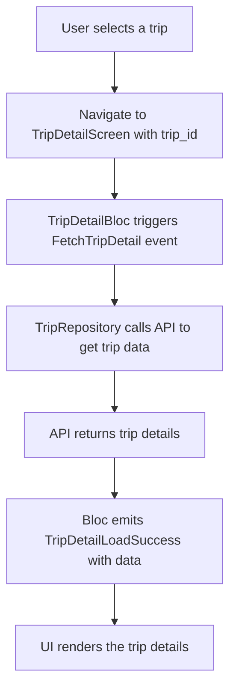
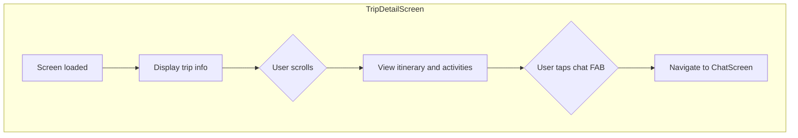

# Trip Detail Screen

**Path:** `lib/src/presentation/trip/details/trip_detail_screen.dart`
**Purpose:** Display detailed trip information, including schedule and planning status, and provide access to the chat screen.
**Design:** See in exactly order:
- docs/resource/trip-detal-top.png
- docs/resource/trip-detail-bottom.png
- docs/resource/trip-detail-carousel-scroll.png
**Last Updated:** July 12th, 2025

---

## Quick Overview

**Key Features:**
- **Structured Layout:** Presents trip information in three main sections: a top header, a summary section, and a daily itinerary carousel.
- **Comprehensive Details:** Shows destination, dates, duration, and status.
- **Detailed Itinerary:** Displays a day-by-day plan with activities in a horizontal carousel at the bottom of the screen.
- **Activity Information:** Each activity includes details like time, location, cost, and booking info.
- **Planning Status:** Reflects the real-time progress of the AI trip planner.
- **Chat Integration:** A floating action button to seamlessly switch to the chat screen for planning adjustments.
- **State Handling:** Manages loading, success, and error states gracefully.

---

## Key Files

```
lib/
└── src/
    ├── presentation/
    │   └── trip/
    │       └── details/
    │           ├── trip_detail_screen.dart       # Main trip detail UI widget
    │           └── bloc/
    │               ├── trip_detail_bloc.dart     # Trip detail business logic
    │               ├── trip_detail_event.dart    # Trip detail events
    │               └── trip_detail_state.dart    # Trip detail state management
    ├── domain/
    │   └── repository/
    │       └── trip_repository.dart              # Trip repository interface
    └── data/
        ├── repository/
        │   └── trip_repository_impl.dart         # Trip repository implementation
        └── datasource/
            └── api_client.dart                   # API client for trip endpoints
```

---

## Workflow

### 1. Data Flow

### 2. User Interaction


---

## Screen Requirements

**UI Components:**
- **AppBar:** Displays trip title or destination.
- **Top Section:** A header containing the primary trip visual and essential information like destination and dates (as seen in `trip-detal-top.png`).
- **Summary Section:** A section below the header for other key details like status, cost, and planning notes (as seen in `trip-detail-bottom.png`).
- **Itinerary Carousel:** A carousel slider at the end of the screen to display each day's plan (as seen in `trip-detail-carousel-scroll.png`).
- **Activity Card:** Displays details for each activity within a day's itinerary.
- **Floating Action Button:** A button to navigate to the chat screen.
- **Loading Indicator:** Shown while fetching data.
- **Error Message:** Displayed if the API call fails.

**Functionality:**
- Fetch trip details from the API using the `trip_id`.
- Display all trip information in a structured and readable format.
- Handle loading and error states.
- Navigate to the chat screen when the FAB is pressed.

---

## State Management

**TripDetailState:**
```dart
import 'package:equatable/equatable.dart';
import 'package:travel_plan_mobile/src/domain/entity/trip.dart';

abstract class TripDetailState extends Equatable {
  const TripDetailState();

  @override
  List<Object?> get props => [];
}

class TripDetailInitial extends TripDetailState {}

class TripDetailLoading extends TripDetailState {}

class TripDetailLoadSuccess extends TripDetailState {
  final Trip trip;
  final PlanningStatus? planningStatus;

  const TripDetailLoadSuccess({required this.trip, this.planningStatus});

  @override
  List<Object?> get props => [trip, planningStatus];
}

class TripDetailLoadFailure extends TripDetailState {
  final String error;

  const TripDetailLoadFailure(this.error);

  @override
  List<Object?> get props => [error];
}
```

**TripDetailEvent:**
```dart
import 'package:equatable/equatable.dart';

abstract class TripDetailEvent extends Equatable {
  const TripDetailEvent();

  @override
  List<Object?> get props => [];
}

class FetchTripDetail extends TripDetailEvent {
  final String tripId;

  const FetchTripDetail(this.tripId);

  @override
  List<Object?> get props => [tripId];
}
```

**TripDetailBloc:**
```dart
import 'package:flutter_bloc/flutter_bloc.dart';
import 'package:travel_plan_mobile/src/domain/repository/trip_repository.dart';
import 'package:travel_plan_mobile/src/presentation/trip/details/bloc/trip_detail_event.dart';
import 'package:travel_plan_mobile/src/presentation/trip/details/bloc/trip_detail_state.dart';

class TripDetailBloc extends Bloc<TripDetailEvent, TripDetailState> {
  final TripRepository _tripRepository;

  TripDetailBloc(this._tripRepository) : super(TripDetailInitial()) {
    on<FetchTripDetail>(_onFetchTripDetail);
  }

  Future<void> _onFetchTripDetail(
    FetchTripDetail event,
    Emitter<TripDetailState> emit,
  ) async {
    try {
      emit(TripDetailLoading());
      final tripDetailData = await _tripRepository.getTripDetails(event.tripId);
      emit(TripDetailLoadSuccess(
        trip: tripDetailData.trip,
        planningStatus: tripDetailData.planningStatus,
      ));
    } catch (e) {
      emit(TripDetailLoadFailure('Failed to load trip details'));
    }
  }
}
```

---

## UI Implementation

**TripDetailScreen:**
```dart
import 'package:flutter/material.dart';
import 'package:flutter_bloc/flutter_bloc.dart';
import 'package:go_router/go_router.dart';
import 'package:travel_plan_mobile/src/presentation/trip/details/bloc/trip_detail_bloc.dart';
import 'package:travel_plan_mobile/src/presentation/trip/details/bloc/trip_detail_event.dart';
import 'package:travel_plan_mobile/src/presentation/trip/details/bloc/trip_detail_state.dart';
import 'package:travel_plan_mobile/injection.dart';

class TripDetailScreen extends StatelessWidget {
  const TripDetailScreen({super.key, required this.tripId});

  final String tripId;

  @override
  Widget build(BuildContext context) {
    return BlocProvider(
      create: (context) => di<TripDetailBloc>()..add(FetchTripDetail(tripId)),
      child: const TripDetailView(),
    );
  }
}

class TripDetailView extends StatelessWidget {
  const TripDetailView({super.key});

  @override
  Widget build(BuildContext context) {
    return Scaffold(
      appBar: AppBar(
        title: const Text('Trip Details'),
      ),
      body: BlocBuilder<TripDetailBloc, TripDetailState>(
        builder: (context, state) {
          if (state is TripDetailLoading) {
            return const Center(child: CircularProgressIndicator());
          } else if (state is TripDetailLoadSuccess) {
            return SingleChildScrollView(
              padding: const EdgeInsets.all(16.0),
              child: Column(
                crossAxisAlignment: CrossAxisAlignment.start,
                children: [
                  // 1. Top Section (based on trip-detal-top.png)
                  Text(state.trip.destination, style: Theme.of(context).textTheme.headlineMedium),
                  Text('${state.trip.startDate} - ${state.trip.endDate}'),
                  const SizedBox(height: 16),

                  // 2. Bottom/Summary Section (based on trip-detail-bottom.png)
                  const Text('Trip Summary', style: TextStyle(fontWeight: FontWeight.bold)),
                  Text('Status: ${state.trip.status}'),
                  Text('Estimated Cost: ${state.trip.estimatedTotalCost} ${state.trip.budgetCurrency}'),
                  const SizedBox(height: 24),

                  // 3. Itinerary Carousel (based on trip-detail-carousel-scroll.png)
                  const Text('Daily Schedule', style: TextStyle(fontWeight: FontWeight.bold)),
                  const SizedBox(height: 8),
                  CarouselSlider.builder(
                    itemCount: state.trip.itinerary.length,
                    itemBuilder: (context, index, realIndex) {
                      final dayItinerary = state.trip.itinerary[index];
                      return Card(
                        child: Padding(
                          padding: const EdgeInsets.all(16.0),
                          child: Column(
                            crossAxisAlignment: CrossAxisAlignment.start,
                            children: [
                              Text('Day ${dayItinerary.dayIndex}: ${dayItinerary.theme ?? ''}', style: Theme.of(context).textTheme.titleLarge),
                              // TODO: Display activities for the day
                            ],
                          ),
                        ),
                      );
                    },
                    options: CarouselOptions(
                      height: 400,
                      enlargeCenterPage: true,
                      viewportFraction: 0.8,
                      enableInfiniteScroll: false,
                    ),
                  ),
                ],
              ),
            );
          } else if (state is TripDetailLoadFailure) {
            return Center(child: Text(state.error));
          }
          return const SizedBox.shrink();
        },
      ),
      floatingActionButton: FloatingActionButton(
        onPressed: () {
          context.push('/chat');
        },
        child: const Icon(Icons.chat_bubble_outline),
      ),
    );
  }
}
```

---

## Domain Layer

**Entities:**

These entities are simplified representations. The actual models in `lib/src/domain/entity/` would be generated from the API response schema and include all fields.

```dart
// Represents the successful response from the trip detail API
class TripDetailData {
    final Trip trip;
    final PlanningStatus? planningStatus;

    TripDetailData({required this.trip, this.planningStatus});
}

class Trip {
  final String tripId;
  final String destination;
  final DateTime startDate;
  final DateTime endDate;
  final String? title;
  final String status;
  final List<Itinerary> itinerary;
  
  // ... other fields like cost, description, etc.
}

class Itinerary {
  final int dayIndex;
  final DateTime date;
  final String? theme;
  final List<Activity> activities;
  
  // ... other fields like total_cost, weather, etc.
}

class Activity {
  final String id;
  final String name;
  final String type;
  final String? description;
  
  // ... other fields like location, time, cost, etc.
}

class PlanningStatus {
    final String tripId;
    final String state;
    final int currentDay;
    final int totalDays;
    final double progress;
    
    // ... other fields
}
```

**TripRepository Interface:**

```dart
import 'package:travel_plan_mobile/src/domain/entity/trip.dart';

abstract class TripRepository {
  Future<TripDetailData> getTripDetails(String tripId);
}
```

---

## Data Layer

**TripRepositoryImpl:**

This class will fetch data from the API and convert it into the domain entities.

```dart
import 'package:travel_plan_mobile/src/data/datasource/api_client.dart';
import 'package:travel_plan_mobile/src/domain/entity/trip.dart';
import 'package:travel_plan_mobile/src/domain/repository/trip_repository.dart';

class TripRepositoryImpl implements TripRepository {
  final ApiClient _apiClient;

  TripRepositoryImpl(this._apiClient);

  @override
  Future<TripDetailData> getTripDetails(String tripId) async {
    try {
      final response = await _apiClient.get('/trips/$tripId');
      // Here you would parse response.data into Trip and PlanningStatus models
      // using a fromJson factory constructor in each model class.
      // For example:
      // final trip = Trip.fromJson(response.data['data']['trip']);
      // final planningStatus = response.data['data']['planning_status'] != null
      //     ? PlanningStatus.fromJson(response.data['data']['planning_status'])
      //     : null;
      // return TripDetailData(trip: trip, planningStatus: planningStatus);
      
      // Placeholder implementation:
      throw UnimplementedError('API parsing not implemented in documentation');
    } catch (e) {
      // Handle DioError or other exceptions
      throw Exception('Failed to get trip details: $e');
    }
  }
}
```

**Models:**

The data models in `lib/src/data/model/` would typically be generated using `json_serializable` and include `fromJson`/`toJson` methods to handle API data.

---

## API Contract: Get Trip Details

This section contains the detailed API contract for fetching trip details.

**GET** `/trips/{trip_id}`

### Description
Retrieves detailed information about a specific trip, including trip metadata, current status, and planning progress.

### Path Parameters
| Parameter | Type | Required | Description |
|-----------|------|----------|-------------|
| `trip_id` | string | Yes | Unique identifier for the trip |

### Success Response (200 OK)
The response contains `trip` and `planning_status` objects.

```json
{
  "success": true,
  "data": {
    "trip": {
      "trip_id": "string",
      "destination": "string",
      "start_date": "2024-01-15",
      "end_date": "2024-01-20",
      "status": "planning_in_progress",
      "itinerary": [
        {
          "day_index": 1,
          "date": "2024-01-15",
          "activities": [
            {
              "id": "activity_1",
              "name": "Eiffel Tower Visit",
              "type": "sightseeing",
              // ... other activity fields
            }
          ]
          // ... other itinerary fields
            }
      ]
      // ... other trip fields
    },
    "planning_status": {
      "trip_id": "string",
      "state": "planning",
      "progress": 33.3
      // ... other status fields
    }
  },
  "error": null,
  "timestamp": "2024-01-15T08:30:00Z"
}
```

### Error Responses
- **404 Not Found:** `{"success": false, "error": "Trip not found"}`
- **403 Forbidden:** `{"success": false, "error": "Access denied"}`
- **500 Internal Server Error:** `{"success": false, "error": "Failed to get trip"}`

(For a full schema of all fields, refer to the original API documentation or the generated data models.)

---

## Dependency Injection

**Injection Configuration:**

```dart
// In injection.dart
void setupInjection() {
  // ... existing dependencies ...

  // Trip Detail dependencies
  di.registerLazySingleton<TripRepository>(
    () => TripRepositoryImpl(di<ApiClient>()),
  );
  
  di.registerFactory<TripDetailBloc>(
    () => TripDetailBloc(di<TripRepository>()),
  );
}
```

---

## Router Integration

**Route Configuration:**

```dart
// In router.dart
GoRoute(
  path: '/trip-detail/:tripId',
  builder: (context, state) {
    final tripId = state.pathParameters['tripId']!;
    return TripDetailScreen(tripId: tripId);
  },
),
```
Usage: `context.push('/trip-detail/some-trip-id')`

---

## User Feedback Messages

- **Loading:** `CircularProgressIndicator` is shown.
- **Error:** "Failed to load trip details" is displayed.
- **Success:** The trip details are rendered on the screen.

---

## Implementation Notes

1.  **Data Models:** The domain entities should be robust and match the API response. Using a code generation tool like `json_serializable` is highly recommended to avoid manual parsing errors.
2.  **UI:** The UI is structured vertically with a top section for the header, a summary section for key details, and a `carousel_slider` at the bottom to display the daily itinerary. Each item in the carousel represents a day and its activities. For performance, `ListView.builder` should be used within each day's card to render activities if they can be numerous.
3.  **Error Handling:** The repository implementation should catch exceptions from the `ApiClient` and propagate them in a controlled manner for the BLoC to handle.
4.  **Navigation:** The screen expects a `tripId` as a path parameter. The floating action button provides a direct link to the chat screen for a seamless user experience.